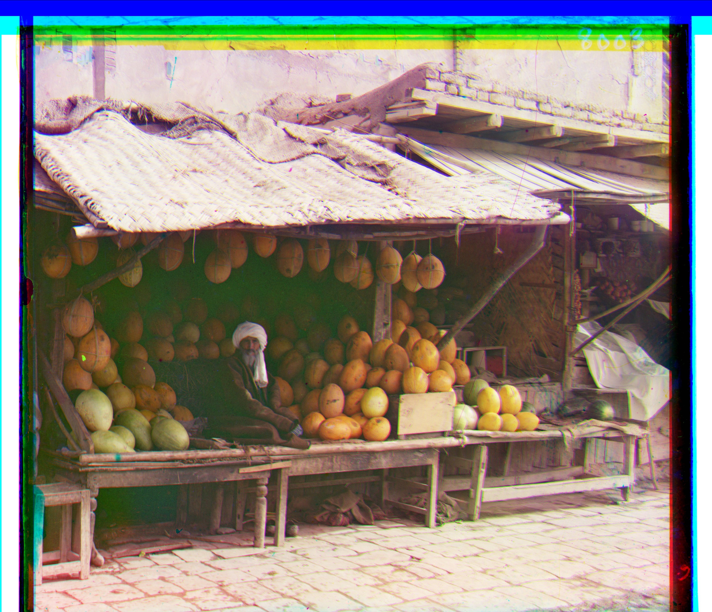

# Prokudin-Gorskii-Images
In 1955, a Scottish scientist named James Clerk Maxwell introduced a method for color imaging. This method uses three filters, each in one of the three main colors red, green, and blue. They are sensitive. Each of these filters records the brightness of one of the three primary colors. Then, by combining this Three colors can recreate a color image. in this project, our goal was to write a program that gives us the colored image from digitized images.
 
you can see the result for this project in the following figures:

# Main Image

  

# Results

  

